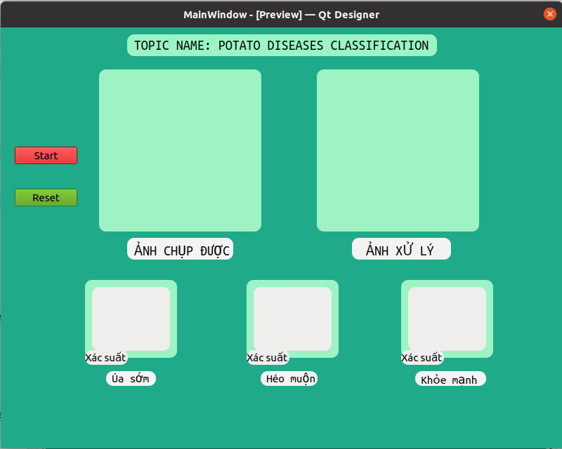
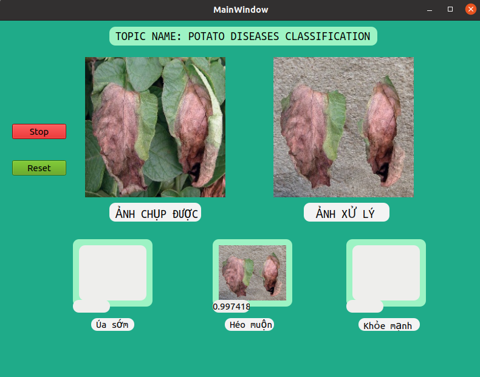

# Potato-Diseases

## Introduction
**This project aims at building a potato leaf disease classification to support farming robot**

Many plant diseases have distinct visual symptoms which can be used to identify and classify them correctly. This project builds a potato leaf disease classification system using deep learning. 
The project is decomposed in four modes: 'data collection', 'training', 'UI design' and 'data communication'.

## Prepare data

To create data for training, I gathered potato leaf from two different sources: [Kaggle](https://www.kaggle.com/datasets/vipoooool/new-plant-diseases-dataset) and Vietnamese Farms.
For this project, I focused on 3 classes of potato leaf disease: Healthy (khỏe mạnh), early blight (úa sớm), late blight (héo muộn).

To prepare the data, I recommend to create the following structure as the image bellow:


## Training

The model used for training is a pretrained VGG16. The classifier layer was modified with three classes and I freezed all layers before it. If you want to update all of them, just set 'requires_grad_(True)' in line 9 of 'network.py'.
As input to the network, images was resize to (224,224). To classify diseases, I used Softmax activation with total probability is 1.


Model is compiled with Adam optimizer and the loss function used is the Cross Entropy loss.

Training on Google Colab. Best weights are automatically saved during training as 'VGG16_custom.pth'

At the end, the accuracy is 98% overall. Model can be downloaded from [here](https://drive.google.com/file/d/1RrBEwFXkCrPUy14wAMCJcaWnyTgjLxCE/view?usp=sharing)

## UI Design

I used Qt5 Designer to design UI. There are 2 buttons and 5 labels to show image, which was captured by robot.



'Start' button: Start system

'Reset' button: Clear all image and number on UI screen

'ẢNH CHỤP ĐƯỢC' label: Show original image from robot

'ẢNH XỬ LÝ' label: Show image after using grabcut method to segment leaf from background

Predicted disease leaf image will show on small label bellow with its probability.
Examples:



## Data communication

I used Firebase of Google to put and get image between robot and server.


## How to use ?

```
- Clone this repository
- pip install -r requirements.txt
- python main.py OPTIONS

* Modes of the program (Possible OPTIONS):

--use_webcam: default=False, type=bool

--min_duration: default=2, type=int
```

More options in 'utils/config.py'